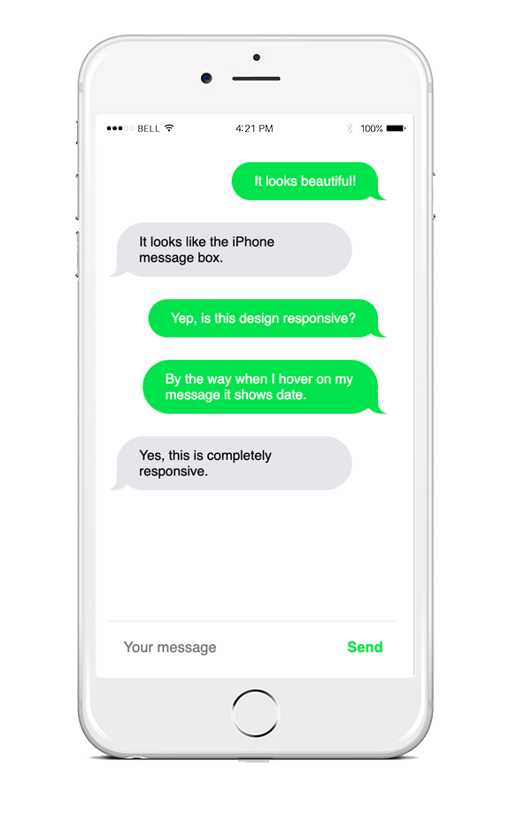

# IOS like iMessage Interface
I create Apple's iOS9 iMessage front-end development with HTML, CSS and jQuery. It's completely responsive. Enjoy!

1. Installing repo
```javascript
git clone https://github.com/Vatanay/ios-like-imessage.git
```

```javascript
cd ios-like-imessage
```

2. NPM Install (only for jQuery)

```javascript
npm install
```

Done!

